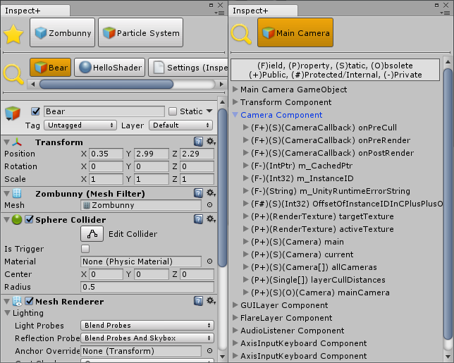

# Unity Inspect+ Plugin

This plugin helps you view an object's Inspector in a separate tab/window, copy&paste the values of variables in the Inspector and inspect all variables of an object (including non-serializable and static variables) in an enhanced Debug mode.

**[Support the Developer ☕](https://yasirkula.itch.io/unity3d)**

## How To

After importing [InspectPlus.unitypackage](https://github.com/yasirkula/UnityInspectPlus/releases) to your project, you are good to go!

- You can open the Inspect+ window in a number of ways: 
  - right clicking an object in *Project* or *Hierarchy* windows
  - right clicking an *Object* variable in the Inspector
  - right clicking a component in the Inspector
- You can right click an object in the **History** list to add it to the **Favorites** list
- You can drag&drop objects to the History and Favorites lists to quickly fill these lists
- You can right click the icons of the History and Favorites lists to quickly select an object from these lists
- You can right click variables in the Inspector to copy&paste their values (variables that are not drawn with *SerializedProperty* don't support this feature)
- You can right click the Inspect+ tab to enable **Debug mode**: you can inspect all variables of an object in this mode, including static, readonly and non-serializable variables
- You can show the Inspect+ window from your editor scripts by calling the `InspectPlusNamespace.InspectPlusWindow.Inspect` functions
